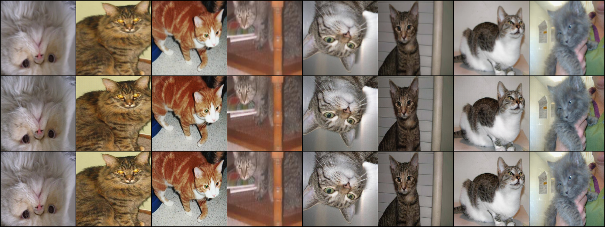

# Image Upscalar
## Upscaling 
Image upscaling describes the task of halucinating missing information of a high-resolution image from low-resolution  base image. 

 
*Image upscaler. Top row is the (bi-linear scaled) input image of 64x64 pixel resolution, middle row is the result of the upscaler (512x512 pixels) and bottow row is ground truth.*

In this repository, a very simple technique is shown solving this problem by upscaling images from 64x64 pixels to 512x512 pixels. Thus, the base image provides only 1/64th of the information in the final image. Upscaling is still possible because pixels intensities are highly correlated in the spatial domain. In classical upscaling this is exploited by, for example, bi-linear interpolation of missing pixel intensities from neighbouring keypoints. This yields reasonable results, however resulting images are generally very blurry as bi-linear upscaling fails to properly catch edges and corners in the image. Deep neural networks can be used to provide better results and retain more of the original information. 
## Step-by-step upscaling
Directly scaling up an image from 64x64 pixels to 512x512 pixels is quite hard, thus a step-wise approach is choosen here. First, an upscaler of factor 2 is learned. Three variants of the same network architecture are trained, one upscaling 64x64 to 128x128, one upscaling 128x128 to 256x256 and the last one upscaling 256x256 to 512x512 pixels. The networks are training indepedently on pairs of ground truth images with their downsampeled counter part. 

In the network, the image is first convoluted with a 5x5 kernel and a stride of 2 followed by batch normalization and ReLU activations. The number of channels is quadrupled with each step to minimize information loss. These convolution increase the receptive field of the convolutions, allowing the following upscaling to use more information from the direct neighborhood of the target pixel for its final results. Upscaling itself is then done with [transposed 2d convolutions](https://d2l.ai/chapter_computer-vision/transposed-conv.html) with 4x4 kernels, again followed by batch normalization and ReLU activations. 

    class Upsampler(nn.Module):
        """Upsampler by a factor of 2"""
        def __init__(self):
            super().__init__()

            self.fw = nn.Sequential(
              nn.Conv2d(in_channels=3, out_channels=16, kernel_size=5, stride=2, padding=2),
              nn.BatchNorm2d(num_features=16),
              nn.ReLU(),
              nn.Conv2d(in_channels=16, out_channels=64, kernel_size=5, stride=2, padding=2),
              nn.BatchNorm2d(num_features=64),
              nn.ReLU(),
              nn.Conv2d(in_channels=64, out_channels=256, kernel_size=5, padding=2),
              nn.BatchNorm2d(num_features=256),
              nn.ReLU(),
              nn.ConvTranspose2d(in_channels=256,out_channels=64,kernel_size=4, stride=2, padding=1),
              nn.BatchNorm2d(num_features=64),
              nn.ReLU(),
              nn.ConvTranspose2d(in_channels=64,out_channels=16,kernel_size=4, stride=2, padding=1),
              nn.BatchNorm2d(num_features=16),
              nn.ReLU(),
              nn.ConvTranspose2d(in_channels=16,out_channels=3,kernel_size=4, stride=2, padding=1),
              nn.Tanh()
            )

        def forward(self, x):
            return self.fw(x)

Mean-Squared error loss between the resulting image and the original ground truth image is used to train the network with AdamW (Adam with proper weight regularization) is used as the optimization algorithm.

 
*Results of the upscaler on 64x64 image resolution. Top row is the (bi-linear scaled) input image, middle row is the result of the upscaler and bottow row is ground truth.*

 
*Results of the upscaler on 128x128 image resolution. Rows same as above.*

 
*Results of the upscaler on 256x256 image resolution. Rows same as above.*

In the above figures one can see the different qualities achieved for the various different input resolutions. It is clearly visibile that he learned upscaler provides higher quality and sharper edges, especially around the eyes of the cats. Upscaling to 128x128 pixels provides the most visible different compared to the 64x64 input images wheres upscaling to 256x256 pixels provide the overall best quality results. Upscaling to 512x512 pixels does not provide a significant advantage anymore as most of the training samples are lower resolution anyway and thus no additional information can be obtained from these samples. 

## Finetuning on the 8x upscaler
To upscale from 64x64 to 512x512 resolution, the three upscalers are concatenated to form one big network. The pre-trained weights are loaded and the network is finetuned to decrease the overall loss. 

 
*Results of the stacked upscaler going from 64x64 directly to 512x512 pixels. Rows same as above.*

    class Upsampler8x(nn.Module):
        """Upsampler by a factor of 8"""
        def __init__(self):
            super().__init__()
            self.upsample_64 = Upsampler()
            self.upsample_128 = Upsampler()
            self.upsample_256 = Upsampler()
            
        def load_checkpoints(self):
            cp = torch.load("upscaler_64to128.pt")
            self.upsample_64.load_state_dict(cp["model_state_dict"])

            cp = torch.load("upscaler_128to256.pt")
            self.upsample_128.load_state_dict(cp["model_state_dict"])

            cp = torch.load("upscaler_256to512.pt")
            self.upsample_256.load_state_dict(cp["model_state_dict"])

        def forward(self, x):
            return self.upsample_256(self.upsample_128(self.upsample_64(x)))